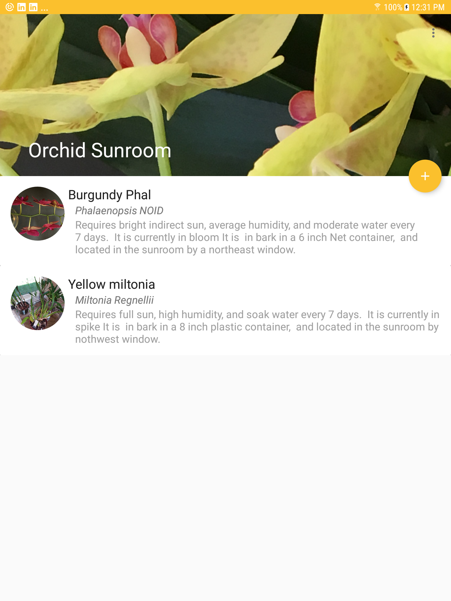
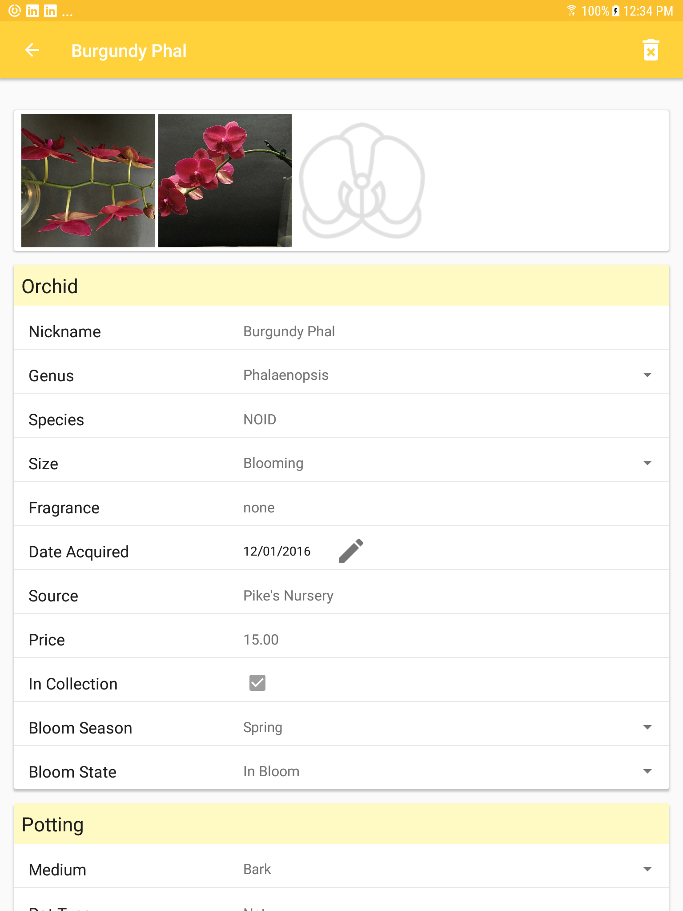

 This repository contains information about **OrchidSunroom**, a Android Material design app I am currently designing and implementing in Kotlin on behalf of professional and amateur Orchid growers and enthusiasts to manage their collections.

 ## Features

This project is designed to conform with Google's latest Material Design UI/UX standards. Features may or may not be completed and include, but are not limited to:

Google's latest Material AppCompat and Design library widgets, including CoordinatorLayout, AppBarLayout, CollapsingToolbarLayout, Toolbar, NestedScrollView, TabLayout, ViewPager, RecyclerView, and CardView.

A multi-table SQLite database and for storing, retrieving, and managing data.

A detail screen shows details about an Orchid, including genus and species details, as well as history, care and culture information.

Allows user to select multiple images of each orchid using the camera, device, or cloud, for each orchid and view images as thumbnails and in full-screen mode.  

Provided a variety of portrait and landscape layouts to support both phones and tablets in a variety of screen resolutions. 

## Screenshots

 

## Contributors

Jill Heske

